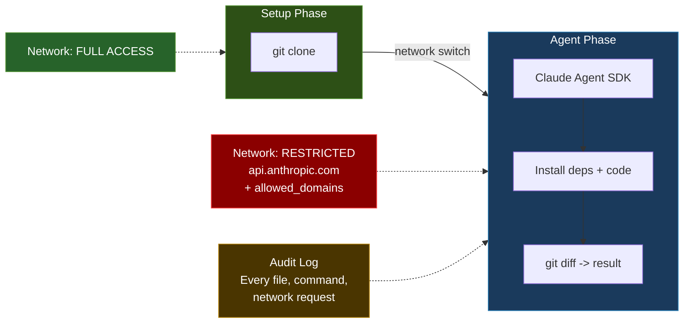

# sandclaude

[](https://github.com/kosaki-kamui/sandclaude/actions/workflows/ci.yml)
[](LICENSE)
[](https://www.python.org/downloads/)

**Run Claude as a headless coding agent on your own infrastructure.** Submit tasks via API, get diffs back — no terminal babysitting, no code leaving your VPC.

> **Note:** This is a community project and is not affiliated with or endorsed by Anthropic.

## Why This Exists

Claude Code in your terminal is great for interactive work. But sometimes you want to:

- **Submit 10 tasks and go to lunch** - not sit there approving each file edit
- **Keep proprietary code off third-party servers** - only API messages reach Anthropic, never your full repo
- **Get a structured audit trail** - every file read, every command run, network requests inferred from tool calls
- **Run tasks from CI, Slack, or a webhook** - not just from a developer's terminal
- **Let your team share one agent server** - with concurrent execution and priority queues

sandclaude is the bridge between "Claude can code" and "Claude can code *for my organization, unattended, with guardrails.*"

## How It's Different from Claude Code

| | Claude Code (terminal) | sandclaude |
|---|---|---|
| **Interaction** | Interactive - asks permission per action | Headless - auto-accepts, you review the diff after |
| **Workflow** | Sit at terminal the whole time | Fire-and-forget via API |
| **Concurrency** | One task per terminal | Up to 3 parallel (configurable) |
| **Network** | Full internet, no restrictions | Sandboxed - only Anthropic API + your allowlist |
| **Audit** | Scroll through terminal history | Structured JSON: files, commands, network (best-effort), cost |
| **Data residency** | Code on your laptop | Code stays in your VPC / AWS / on-prem server |
| **Team access** | One developer at a time | Shared server with API auth |
| **Cost tracking** | Check Anthropic dashboard | Per-task: tokens in/out, USD cost |
| **Notifications** | Watch the terminal | Slack/webhook on completion or failure |
| **GitHub PRs** | Create manually | One API call (requires `gh` CLI) |
| **Best for** | Pair-programming, exploration | Batch jobs, CI, team agent, compliance work |

## Key Features

- **Fire-and-forget execution** - submit via REST API or MCP plugin, check back later
- **Two-phase network sandbox** - full internet for setup, locked down for agent execution
- **Structured audit trail** - every file touched, command run, and network requests inferred from tool calls (not packet-level capture)
- **Concurrent task pool** - run multiple tasks in parallel with priority queue (high/normal/low)
- **Per-task cost tracking** - tokens in, tokens out, USD cost per task
- **Webhook + Slack notifications** - get pinged when tasks complete or fail, with inline diff, cost, and audit summary
- **One-click GitHub PRs** - `POST /tasks/{task_id}/create-pr` turns a completed task into a PR with AI-generated summary (requires [`gh` CLI](https://cli.github.com) + `GIT_TOKEN`)
- **Claude Code MCP plugin** - use sandclaude from inside Claude Code with natural language
- **Automatic cleanup** - old tasks auto-deleted after configurable retention period
- **Orphan recovery** - crashed containers detected and cleaned up on server restart

## Two-Phase Sandbox Architecture



Every task runs in two phases inside a Docker container:
1. **Setup Phase** - full internet access to clone the repo
2. **Agent Phase** - network restricted to `api.anthropic.com` + configurable `allowed_domains` (e.g., package registries). Claude determines and installs dependencies itself. All other outbound traffic, ICMP, and IPv6 are blocked via in-container iptables rules

> **Note on IP resolution:** Allowed domains are resolved to IP addresses on the host *before* the agent phase begins, and static iptables rules are written for those IPs. If a domain uses CDN/IP rotation, the resolved IPs may go stale during long-running tasks. This rarely affects typical tasks (which complete in minutes), but may cause intermittent connectivity for very long tasks against domains with aggressive IP rotation. An ipset refresh strategy is planned for a future release.

## Quick Start

```bash
# Prerequisites: Python 3.10+, Docker
# Optional for PR creation: gh CLI (https://cli.github.com) + GIT_TOKEN

# 1. Clone and install
git clone https://github.com/kosaki-kamui/sandclaude.git
cd sandclaude
pip install .

# 2. Build the runner image (required for task execution)
docker build -t sandclaude-runner -f Dockerfile.runner .

# 3. Initialize (generates auth token)
sandclaude init

# 4. Start the server
ANTHROPIC_API_KEY=sk-ant-... uvicorn sandclaude.api.main:app --port 3271

# 5. Submit a task
curl -X POST http://localhost:3271/tasks \
  -H "Authorization: Bearer $(cat data/.token)" \
  -H "Content-Type: application/json" \
  -d '{"repo":"https://github.com/user/repo","prompt":"Fix the auth bug"}'
```

**For detailed step-by-step guides** (AWS deployment, MCP plugin setup, private repos, PR creation), see **[Getting Started Guide](docs/GETTING_STARTED.md)**.

## How It Works

```
Developer                    sandclaude                     Docker Container
  |                              |                                  |
  | POST /tasks                  |                                  |
  | {repo, prompt}               |                                  |
  |----------------------------->|                                  |
  |                              | Create container on setup-net    |
  |                              |--------------------------------->|
  |                              |                                  | git clone
  |                              | Switch to agent-net              |
  |                              | Apply iptables rules             |
  |                              |--------------------------------->|
  |                              |                                  | Claude Agent SDK
  |                              |                                  | reads/edits files
  |                              |                                  | runs commands
  |                              | Collect diff + audit log         |
  |                              |<---------------------------------|
  | GET /tasks/{task_id}         |                                  |
  | <- diff, audit, cost         |                                  |
```

## Who Is This For

**Solo developers & freelancers** - submit a batch of tasks before bed, wake up to PRs. One person doing the work of three.

**Side project builders** - run Claude against your repo from your phone via API while commuting. Review diffs when you get home.

**Startups** - shared agent server for the whole team. Priority queue means urgent fixes jump ahead of batch refactors. Per-task cost tracking for burn rate visibility.

**Security-conscious teams** - code never leaves your VPC. Agent actions are audited. Network isolation prevents common exfiltration vectors. Strong guardrails for self-hosted agent execution — though not yet VM-level isolation (see [Limitations](#limitations--when-not-to-use-this)).

## API

All endpoints require `Authorization: Bearer <token>` (except `/health`). WebSocket requires the token via `Authorization` header (query-param auth is not supported for security — tokens in URLs leak via logs and proxies).

| Method | Path | Description |
|--------|------|-------------|
| `POST` | `/tasks` | Submit a task `{repo, prompt, model?, branch?, max_turns?, allowed_domains?}` |
| `GET` | `/tasks` | List tasks visible to your auth token |
| `GET` | `/tasks/{task_id}` | Get task details, diff, audit log |
| `GET` | `/tasks/{task_id}/diff` | Get raw diff |
| `GET` | `/tasks/{task_id}/audit` | Get audit log JSON |
| `GET` | `/tasks/{task_id}/result` | Get result summary JSON |
| `GET` | `/tasks/{task_id}/transcript` | Get transcript JSON |
| `DELETE` | `/tasks/{task_id}` | Delete a terminal task (`completed`/`failed`/`cancelled`) and its output files |
| `POST` | `/tasks/{task_id}/cancel` | Cancel a running task |
| `POST` | `/tasks/{task_id}/create-pr` | Create a GitHub PR from completed task |
| `WS` | `/tasks/{task_id}/stream` | Real-time task log streaming (Bearer auth) |
| `GET` | `/pool` | Runner pool stats (active, queued, max) |
| `GET` | `/health` | Health check (no auth) |

## Claude Code Plugin (MCP)

Register the MCP plugin to use sandclaude from inside Claude Code:

```bash
# From the sandclaude project directory:
claude mcp add --transport stdio sandclaude \
  --env sandclaude_URL=http://localhost:3271 \
  --env sandclaude_TOKEN=$(cat data/.token) \
  -- python -m sandclaude.mcp_plugin
```

Then use natural language:
- *"Submit a task to fix the auth bug in the current repo"*
- *"Check my cloud tasks"*
- *"Show me the result of task-abc12345"*
- *"Create a PR from task-abc12345"*

## Security Model

### Threat Model

| Threat | Mitigation |
|--------|------------|
| Code exfiltration | Network isolation in agent phase - only `api.anthropic.com:443` + `allowed_domains` permitted. DNS restricted to Docker resolver. ICMP and IPv6 blocked. |
| Backdoor injection | All diffs require human review before merge (never auto-merge) |
| Sandbox escape | Docker container isolation + iptables rules inside container |
| Credential theft | API key injected via env var, never on disk in container. Git credentials are short-lived. |

### Audit Trail

Every task produces a structured audit log:
- Files read and written (from Claude's tool calls)
- Shell commands executed (from Bash tool calls)
- Network requests — best-effort, inferred from tool calls (curl/wget in Bash, WebFetch). Not packet-level capture; container-level network logging is planned for a future release
- Token consumption and cost

### What This Does NOT Protect Against

- **Kernel exploits** - Docker isolation is not VM-level. A kernel vulnerability could escape the container. Use Firecracker for stronger isolation (planned for future).
- **Sophisticated network bypass** - iptables rules block common exfiltration vectors (TCP, UDP, ICMP, DNS tunneling) but a determined attacker with kernel access could potentially bypass them.
- **Malicious-looking-benign code** - The agent could write code that passes review but contains subtle backdoors. The audit trail helps but doesn't eliminate this risk.

## Limitations & When NOT to Use This

**Be honest about what this is:**

- **Not more secure than Codex** - OpenAI has a dedicated security team managing Codex infrastructure. sandclaude is a solo/small-team operated project with Docker-level isolation.
- **Not more reliable than Claude Code Web** - Anthropic's infrastructure is professionally managed. Self-hosted means self-operated.
- **Single-machine Docker only** - No Kubernetes, no Firecracker, no multi-region. MVP is designed for a single Docker host.
- **Agent SDK behavior may vary** - The Claude Agent SDK is evolving. Behavior at `maxTurns` limits, error recovery, and context compaction may change between versions.
- **Network audit is best-effort** - Network requests are inferred from tool calls (curl/wget in Bash, WebFetch), not captured at the network level. Container-level packet logging is planned for future.
- **Auth: scoped tokens without full identity** - v0.2.0 adds named tokens with scopes, expiry, and revocation. However, there is no OIDC, SSO, or user identity layer. Tokens are attributed by fingerprint in audit logs, not by user name. Fine for startups; not yet enterprise identity.
- **PR creation requires `gh` CLI** - The `gh` CLI must be installed and reachable. It is pre-installed in the Docker Compose setup, but bare-metal deployments must install it separately. See [gh CLI installation](https://cli.github.com).

**When to use something else:**
- If you're happy with GPT and don't need Claude - use Codex
- If you don't need data residency controls - use Claude Code Web
- If you need enterprise-grade security guarantees - wait for Anthropic's managed offering

## Configuration

| Environment Variable | Default | Description |
|---------------------|---------|-------------|
| `ANTHROPIC_API_KEY` | (required) | Your Anthropic API key |
| `PORT` | `3271` | API server port |
| `TASK_TIMEOUT_S` | `1800` | Max task duration in seconds (30 min) |
| `MAX_CONCURRENT` | `3` | Max concurrent runner containers |
| `HOST_CWD` | `""` | Host working directory for `repo="."` in Docker mode (falls back to current working directory if unset) |
| `ALLOWED_DOMAINS` | (none) | Comma-separated domains allowed in agent phase (e.g. `registry.npmjs.org,pypi.org`) |
| `TASK_RETENTION_DAYS` | `30` | Auto-delete terminal tasks (`completed`/`failed`/`cancelled`) older than this on startup (0 = keep forever) |
| `API_URL` | `http://localhost:3271` | Public URL for generic (non-Slack) webhook payloads |
| `DATA_DIR` | `./data` | Data directory for SQLite DB, task results, auth token |
| `AUTH_TOKENS` | (none) | Optional extra bearer tokens (comma-separated) for multi-client deployments |
| `DOCKER_HOST` | `tcp://socket-proxy:2375` (Compose) | Docker API endpoint used by server |
| `ENVIRONMENT` | `production` | Runtime environment (`production`, `development`, `test`) |
| `SKIP_NETWORK_ISOLATION` | `false` | Skip iptables rules (allowed only in `development`/`test`) |
| `GIT_TOKEN` | (none) | Token for cloning private repos (any HTTPS git host) + creating PRs (GitHub only, via `gh` CLI). Passed as `GH_TOKEN` for PR creation. Scrubbed before agent phase. |
| `ALLOWED_REPO_BASE` | (none) | Comma-separated allowed base dirs for local repo mounts (required in production if not using `HOST_CWD`) |
| `WEBHOOK_INCLUDE_PROMPT` | `false` | Include task prompt excerpt in webhook payloads (off by default for privacy) |

## Demo

```bash
# Quick demo with the included buggy FastAPI app
make setup          # Copy .env.example -> .env
# Edit .env with your ANTHROPIC_API_KEY
make demo           # Start services and submit a task
make status         # Check progress
make result TASK_ID=task-xxx  # View diff and audit log
make clean          # Tear down
```

See [demo/DEMO_SCRIPT.md](demo/DEMO_SCRIPT.md) for a step-by-step presentation walkthrough.

## License

MIT — see [LICENSE](LICENSE).

## Community

- [Changelog](CHANGELOG.md)
- [Contributing Guide](CONTRIBUTING.md)
- [Code of Conduct](CODE_OF_CONDUCT.md)
- [Security Policy](SECURITY.md)
